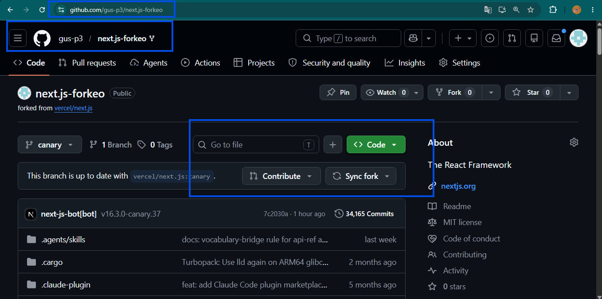
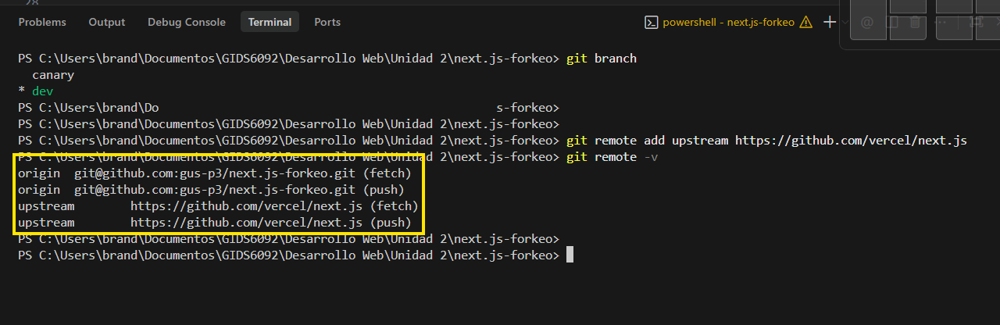
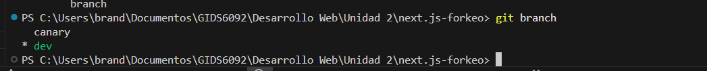
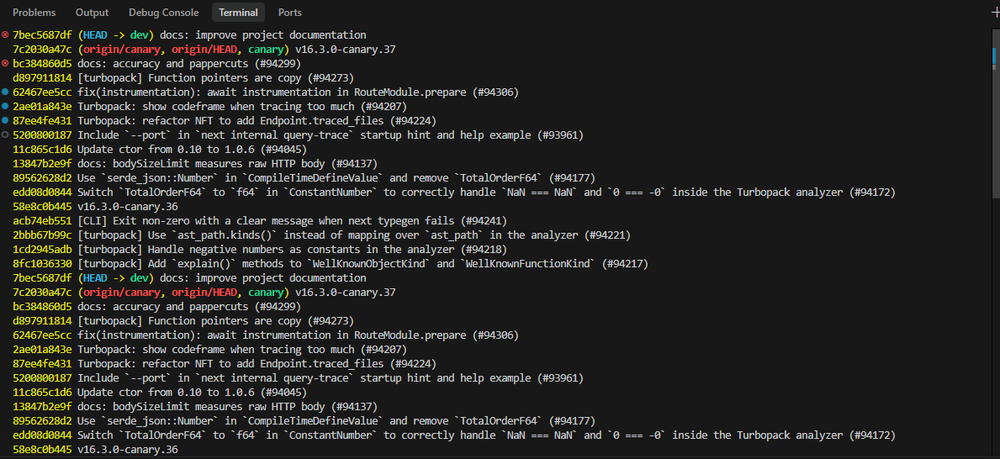
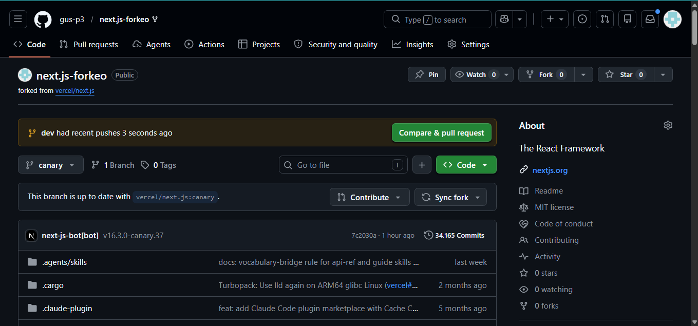
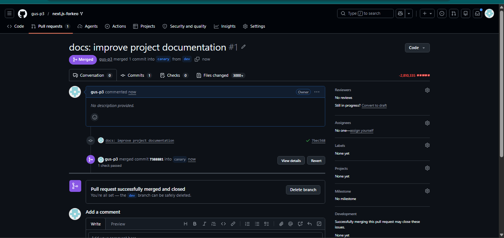
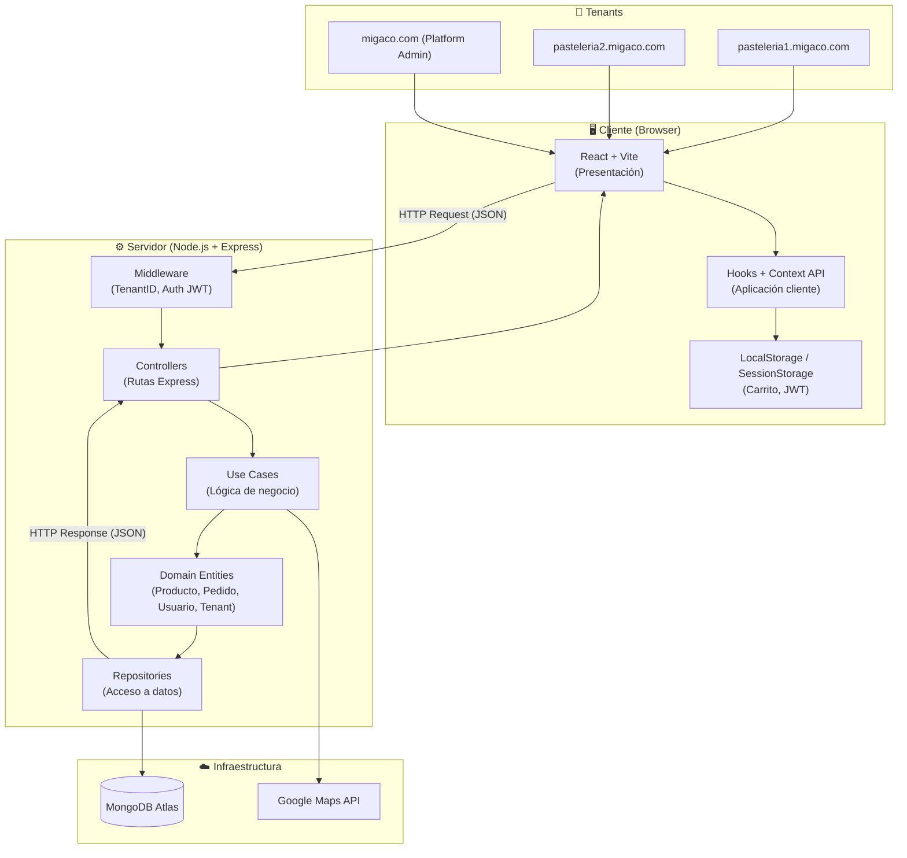

# Student Contribution

## Developer Information

- **Name:** Brandon Gustavo Mendoza Amaro
- **University:** Universidad Tecnológica del Norte de Guanajuato
- **Date:** Junio 2026

## Proposed Improvements

1. Agregar documentación bilingüe (español/inglés) para atraer colaboradores internacionales.
2. Implementar pruebas automatizadas (unit tests) con cobertura mínima del 80%.
3. Agregar guía de contribución (CONTRIBUTING.md) con lineamientos de código y commits.

## Observations

Miga-Co es una plataforma SaaS multi-tenant diseñada para pastelerías artesanales en LATAM. El sistema permite a cada pastelería (tenant) operar su tienda digital de forma independiente sobre una infraestructura compartida, con catálogo experiencial, personalización de pedidos y cálculo logístico en tiempo real.

---

## Evidencias

> **Instrucción:** Captura de pantalla del Fork creado en tu cuenta personal de GitHub.

### Evidencia 1 — Fork del repositorio



---

> **Instrucción:** Resultado del comando `git remote -v` mostrando `origin` y `upstream`.

### Evidencia 2 — Configuración de remotes



---

> **Instrucción:** Resultado del comando `git branch` mostrando la rama `dev` activa.

### Evidencia 3 — Ramas del repositorio



---

> **Instrucción:** Resultado del comando `git log --oneline` mostrando el historial de commits.

### Evidencia 4 — Historial de commits



---

> **Instrucción:** Captura del Pull Request creado en GitHub con título y descripción.

### Evidencia 5 — Pull Request




---

> **Instrucción:** URL del Pull Request generado en GitHub.

### Evidencia 6 — URL del Pull Request

```
https://github.com/USUARIO/REPOSITORIO/pull/NUMERO
```

---

## Project Strengths

> **Actividad A** — Describir al menos 5 fortalezas del proyecto *(Parte 6, Actividad A)*

1. **Arquitectura limpia por capas:** La separación clara entre Presentación, Aplicación, Dominio e Infraestructura facilita el mantenimiento, las pruebas unitarias y el trabajo paralelo entre los miembros del equipo sin generar conflictos.

2. **Modelo SaaS Multi-Tenant nativo:** Desde el diseño inicial, cada colección de MongoDB incluye un `tenantId`, lo que garantiza el aislamiento de datos entre pastelerías y permite incorporar nuevos tenants sin cambios estructurales.

3. **Stack tecnológico moderno y probado:** React 18 + Vite en el frontend junto con Node.js + Express + TypeScript en el backend conforman un ecosistema maduro, con amplia comunidad y soporte a largo plazo (LTS).

4. **Catálogo experiencial (Especialista Virtual):** La ficha de producto con radar de sabor (Dulce, Amargo, Esponjoso, Cremoso), galería multimedia y visualización de alérgenos compensa la falta de contacto físico y eleva la confianza del cliente al comprar en línea.

5. **Diseño mobile-first y responsivo:** La plataforma es accesible desde dispositivos móviles y de escritorio en los navegadores Chrome, Firefox y Safari, lo que amplía significativamente el alcance de mercado para pastelerías pequeñas.

6. **Infraestructura de bajo costo inicial:** El uso de MongoDB Atlas Free Tier y plataformas de despliegue gratuitas (Railway, Render, Vercel) permite lanzar un MVP completamente funcional sin inversión en infraestructura, reduciendo la barrera de entrada.

---

## Improvement Opportunities

> **Actividad B** — Describir al menos 5 oportunidades de mejora *(Parte 6, Actividad B)*

1. **Integración de pasarela de pago real:** Actualmente el módulo de pago por transferencia bancaria es simulado. Integrar Stripe, Conekta o MercadoPago permitiría procesar pagos reales de forma segura y aumentaría la conversión de ventas.

2. **Sistema de notificaciones en tiempo real:** Implementar WebSockets (Socket.io) o notificaciones push para que los clientes reciban actualizaciones del estado de su pedido (Preparando → En camino → Entregado) sin necesidad de recargar la página.

3. **Panel de analíticas por tenant:** Agregar un dashboard con métricas de ventas, productos más vendidos, horarios de mayor tráfico y tasa de conversión del carrito ayudaría a los administradores de pastelería a tomar decisiones basadas en datos.

4. **Internacionalización (i18n):** Añadir soporte multilenguaje (español e inglés como mínimo) mediante `react-i18next` facilitaría la expansión de la plataforma a otros mercados de LATAM y comunidades hispanohablantes en EUA.

5. **Cobertura de pruebas automatizadas:** El SAD establece una cobertura mínima del 60% en lógica de dominio, pero ampliarla con pruebas de integración (Supertest) y pruebas E2E (Playwright o Cypress) reduciría significativamente los errores en producción.

6. **Sistema de cupones y descuentos:** Permitir que cada tenant administre promociones, códigos de descuento y programas de fidelidad incrementaría el ticket promedio y la retención de clientes.

---

## Technology Stack

> **Actividad C** — Tabla de tecnologías utilizadas *(Parte 6, Actividad C)*

| Capa / Componente | Tecnología | Versión | Propósito |
|---|---|---|---|
| Frontend | React + Vite | 18.x / 5.x | Interfaz de usuario SPA (Single Page Application) |
| Enrutamiento | React Router v6 | 6.x | Navegación declarativa y rutas anidadas multi-tenant |
| Backend / API | Node.js + Express | 20.x LTS | Servidor REST API con soporte TypeScript y async/await |
| Lenguaje (backend) | TypeScript | 5.x | Tipado estático para mayor mantenibilidad |
| Base de Datos | MongoDB Atlas | 7.x | Base de datos NoSQL con aislamiento por tenantId |
| Autenticación | JWT + bcrypt | — | Tokens stateless con hash seguro de contraseñas |
| Mapas / Logística | Google Maps API | v3 | Cálculo dinámico de costo de envío por distancia |
| Contenedores | Docker + Compose | LTS | Entorno homogéneo entre desarrollo y producción |
| Control de versiones | Git + GitHub | — | Colaboración en equipo y documentación en GitHub Pages |
| Despliegue | Railway / Render / Vercel | — | Hosting gratuito para MVP inicial |

---

## Architecture Diagram

> **Actividad D** — Diagrama de arquitectura Mermaid *(Parte 6, Actividad D)*



---

## Functional Requirements

> **Actividad E** — Al menos 10 requerimientos funcionales *(Parte 6, Actividad E)*

| ID | Requerimiento Funcional |
|---|---|
| RF-01 | El sistema deberá permitir el registro de clientes mediante correo electrónico y contraseña, validando formato y unicidad del correo. |
| RF-02 | El sistema deberá permitir la autenticación de usuarios mediante JWT, rechazando credenciales inválidas con mensaje de error claro. |
| RF-03 | El sistema deberá mostrar el catálogo de productos de cada pastelería (tenant) con filtros por nombre, categoría, precio y disponibilidad. |
| RF-04 | El sistema deberá mostrar la ficha de producto con galería multimedia, gráfico de radar de sabor (Dulce, Amargo, Esponjoso, Cremoso) y lista de alérgenos. |
| RF-05 | El sistema deberá permitir al cliente personalizar el pedido (mensaje, relleno) y agregar productos al carrito, persistiendo en LocalStorage sin requerir sesión activa. |
| RF-06 | El sistema deberá guiar al cliente por un flujo de checkout: carrito → dirección de entrega → método de pago → confirmación, validando campos en tiempo real. |
| RF-07 | El sistema deberá permitir al administrador de pastelería (Tenant Admin) realizar altas, bajas y modificaciones de productos de su propio catálogo. |
| RF-08 | El sistema deberá permitir al Tenant Admin visualizar y actualizar el estado de los pedidos de su pastelería (Pendiente, Preparando, En camino, Entregado). |
| RF-09 | El sistema deberá aislar los datos de cada tenant mediante un campo `tenantId` en todas las colecciones, validado en cada request del servidor. |
| RF-10 | El sistema deberá permitir al Super Administrador (Platform Admin) registrar, activar y desactivar pastelerías suscritas, y visualizar estadísticas de uso por tenant. |
| RF-11 | El sistema deberá calcular el costo de envío en tiempo real mediante la API de Google Maps según la distancia entre la pastelería y la dirección del cliente. |
| RF-12 | El sistema deberá mostrar una sección de reseñas verificadas con calificación de 1 a 5 estrellas, filtradas por el tenant activo. |

---

## Team Members

> *(Reto adicional — rama `feature/profile`)*

| Nombre | Rol | GitHub |
|---|---|---|
| Brandon Gustavo Mendoza Amaro | Desarrollador  | @gus-p3 |
| Karen | Desarrolladora Frontend | @karen |
| Lizeth | QA / Diseño | @lizeth |